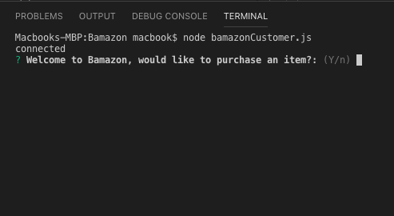
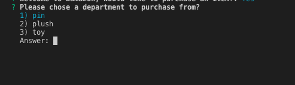
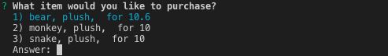
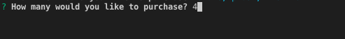
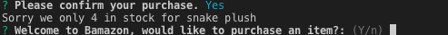

# BAMAZON:

 Bamazon is an Amazon-like storefront with the MySQL skills you learned this unit. The app will take in orders from customers and deplete stock from the store's inventory. 


 ``` node bamazonCustomer.js ```


Welcome Prompt



  

  Choose the department to purchase from.


  


  Select the item you wish to purchase.
  
  


Enter the quantity to purchase.




  Display the total amount to the customer for the purchase.


If not enought items in stock sale fails.




## Getting Started:
These instructions will get you a copy of the project up and running on your local machine for development and testing purposes. See deployment for notes on how to deploy the project on a live system.

## Prerequisites:
You will need to have npm installed on your system. 
 - Type npm -v to verify your system has npm.
 - If you don’t have npm then download it from https://www.npmjs.com/get-npm. 
 - You will need MySQL.
https://www.npmjs.com/package/mysql
 - You will need to installed your own MySQL Workbench.


